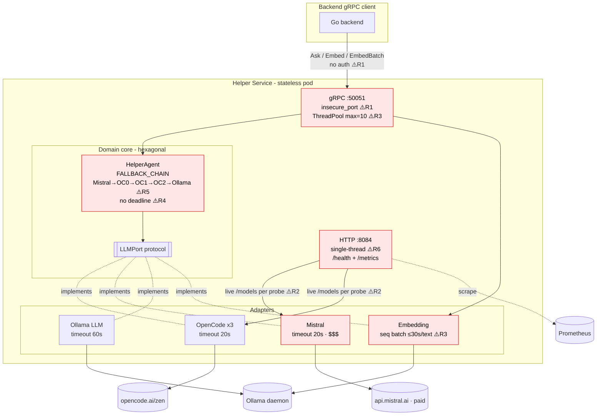

# Helper Service — Architecture, Reliability & Security Audit + Outage FMEA

> **Scope:** `/home/atorresp/projects/HelpingPeople/helper` (v0.4) — stateless Python gRPC LLM-routing + embedding service.
> **Mode:** Read-only audit. No source files were modified. All diffs below are *suggestions* for review.
> **Lens:** Senior Architect + Reliability (SRE) + Security lead, hexagonal/DDD-aware.
> **Date:** 2026-06-30

---

## 1. Executive Summary

The helper service is a clean, well-factored **hexagonal** application: `HelperAgent` (domain core) depends only on the `LLMPort` protocol, adapters are swappable, and there is no DB coupling. Observability (Prometheus metrics, dependency-aware health) is above average for a service this size. The DDD boundaries are genuinely respected.

However, the service is **not production-hardened against the three failure classes it is most exposed to**: cascading latency/cost amplification through the fallback chain, readiness flapping caused by synchronous upstream calls inside the health probe, and an **unauthenticated, plaintext gRPC surface** that exposes paid LLM token spend to anyone who can reach the port.

**Top risks (one line each):**

| # | Risk | Class | Sev | Fix Status |
|---|------|-------|-----|------------|
| R1 | gRPC is `insecure_port` + **no authn** → anyone on the network can burn LLM tokens / exfiltrate answers | Security + Cost | **P0** | **FIXED** — `grpc_server.py:_AuthInterceptor` (shared-secret bearer, constant-time compare), TLS optional via `GRPC_TLS_CERT/KEY_PATH` |
| R2 | `/health` does **live upstream `/models` calls on every probe** → readiness flaps the pod out of service on a transient blip and hammers the provider | Reliability | **P0** | **FIXED** — `grpc_server.py:_refresh_health_cache` background thread (TTL=20s), `/health` reads cache, `/ready` is cheap (gRPC up + last cache) |
| R3 | Single shared `ThreadPoolExecutor(max_workers=10)` + sequential `EmbedBatch` (≤30s/text) + **no `maximum_concurrent_rpcs`** → one backfill starves all chat RPCs | Reliability | **P0** | **FIXED** — `grpc_server.py:serve_grpc` uses `GRPC_MAX_WORKERS=16`, `GRPC_MAX_CONCURRENT_RPCS=32`, configurable message size, keepalive |
| R4 | **No overall request deadline / no client-deadline propagation**; chain walks 20s×4 + 60s Ollama ≈ 140s while the caller has already timed out → retry storm + wasted spend | Reliability + Cost | **P1** | **FIXED** — `helper_agent.py:REQUEST_BUDGET_S=45.0` + `deadline_s` parameter, budget check in `_answer_inner` loop; `grpc_server.py` passes `context.time_remaining()` |
| R5 | **Mistral-large (most expensive model) is FIRST** in the auto fallback chain → every default request pays the premium model first | Cost | **P1** | **FIXED** — `helper_agent.py:FALLBACK_CHAIN` cheap-first: `opencode0,opencode1,opencode2,mistral,ollama`, configurable via `FALLBACK_CHAIN` env |
| R6 | Health/metrics served by **single-threaded `HTTPServer`** → a slow `/health` blocks `/metrics` → Prometheus scrape timeout → observability blind spot during incidents | Reliability | **P1** | **FIXED** — `grpc_server.py:serve_health` uses `http.server.ThreadingHTTPServer` |
| R7 | Container runs as **root**, `COPY . .`, no `HEALTHCHECK`, ships `psycopg2` the server never uses; supply-chain pins have **no integrity hashes** | Security | **P1** | **FIXED** — `Dockerfile`: `RUN useradd ... && USER helper`, explicit `COPY main.py internal/ proto/`, `HEALTHCHECK` via cached `/health`, removed `EXPOSE 8085`; `.dockerignore` added |
| R8 | No input-size cap on `question`/`text` → unbounded prompt forwarded to paid APIs (cost + memory) | Cost | **P2** | **FIXED** — `grpc_server.py:MAX_QUESTION_LENGTH=32000` (env), `INVALID_ARGUMENT` rejection in `Ask` |
| R9 | No graceful shutdown (`SIGTERM` → abrupt kill of in-flight RPCs on every rollout) | Reliability | **P2** | **FIXED** — `main.py:SIGTERM/SIGINT` handler → `shutdown_event.wait()` → `grpc_server.stop(grace=30)` |
| R10 | `auth_errors_total` is documented in README but **does not exist** in `metrics.py`; `classify_error` heuristics misclassify | Observability | **P3** | **FIXED** — `metrics.py`: added `auth_errors_total` counter, `classify_error` uses explicit `isinstance` checks before substring fallback |

**Verdict:** Architecturally sound, operationally fragile. The P0 set is small and self-contained — closing R1–R3 removes the dominant outage and cost-incident vectors without touching the domain core (the hexagonal boundary makes these adapter-layer-only changes).

---

## 2. System & Failure-Mode Diagram



### 2.1 FMEA table (Failure Mode & Effects Analysis)

| Failure mode | Cause | Effect | Detection today | Sev (S·O·D→RPN) | Mitigation |
|---|---|---|---|---|---|
| Token-spend abuse / data exfil | Open, plaintext gRPC; no token | Cost blowout, answer leakage | None | 9·5·8 → **360** | mTLS or shared-secret interceptor (R1) |
| Readiness flap → pod removed | `/health` calls upstream `/models` live each probe | Pod pulled from LB on transient 429/5xx though it could still serve | k8s events only | 8·7·6 → **336** | Cache health, decouple `/ready` from upstream (R2) |
| Thread-pool starvation | 10 workers shared; `EmbedBatch` holds a thread for minutes | Chat `Ask` queues unboundedly, p99 explodes | `active_requests` gauge | 8·6·5 → **240** | Separate executor / cap concurrency / bounded queue (R3) |
| Latency amplification storm | No overall deadline, no circuit breaker | 140s walk while caller gave up; quota burned on dead providers | duration histograms | 7·6·6 → **252** | Per-request budget + deadline propagation + circuit breaker (R4) |
| Cost premium-first | Mistral first in chain | Pays most expensive model on every auto request | `llm_tokens_total{provider}` | 6·8·4 → **192** | Reorder chain / cost-aware routing (R5) |
| Metrics scrape blind spot | Single-thread HTTP; slow health blocks metrics | Prometheus times out exactly during an incident | scrape `up` | 7·5·6 → **210** | `ThreadingHTTPServer` (R6) |
| Container compromise blast radius | Runs as root, full `COPY .` | Privilege escalation, secret leak | None | 7·4·7 → **196** | non-root, minimal copy, HEALTHCHECK, hash-pinned deps (R7) |
| Memory / cost from huge prompt | No input-size guard | OOM risk + token cost | None | 5·5·6 → **150** | Reject oversized `question`/`text` at boundary (R8) |
| In-flight RPC loss on deploy | No SIGTERM grace | Dropped answers each rollout | None | 5·6·5 → **150** | `server.stop(grace)` on signal (R9) |
| Mis-labelled error metrics | `classify_error` string heuristics; missing `auth_errors_total` | Wrong dashboards/alerts | self | 4·6·6 → **144** | Map provider exceptions explicitly (R10) |

---

## 3. Prioritized Backlog (P0–P3)

### P0 — Stop the bleeding (outage / security / cost incident vectors)
- **P0-1 (R1)** Add a gRPC auth interceptor (shared-secret bearer in metadata, constant-time compare) and prefer `add_secure_port` with TLS where the network isn't fully trusted. Emit the already-documented `auth_errors_total`.
- **P0-2 (R2)** Decouple readiness from live upstream calls: add a cheap `/ready` (gRPC up + last-cached adapter status) and make `/health` upstream checks run on a background TTL cache (e.g. 15–30s), never inline on the probe.
- **P0-3 (R3)** Bound the blast radius of embeddings: set `maximum_concurrent_rpcs`, raise/segment the executor, cap message size, and (ideally) run `EmbedBatch` on a separate small pool so chat `Ask` never starves.

### P1 — High value, do this sprint
- **P1-1 (R4)** Add an overall per-`Ask` time budget and honor the client gRPC deadline (`context.time_remaining()`); short-circuit the chain when the budget is spent. Add a lightweight per-provider circuit breaker (open after N consecutive failures, skip for cooldown).
- **P1-2 (R5)** Make the fallback chain cost-aware/config-driven (cheap-first by default; promote Mistral only when quality demands). At minimum, move Mistral out of the unconditional first slot.
- **P1-3 (R6)** Switch the health/metrics server to `ThreadingHTTPServer`.
- **P1-4 (R7)** Harden the Dockerfile: non-root `USER`, `.dockerignore` + explicit copy, `HEALTHCHECK`, drop `psycopg2-binary` from the server image (keep only for the backfill tool image), and add hash-pinned dependency verification.
- **P1-5 (cost obs)** Capture **real** token usage from OpenAI-compatible `response.usage` (input + output) instead of `chars/4`, and add an `input` direction + per-model cost recording rule.

### P2 — Important, schedule soon
- **P2-1 (R8)** Validate `question`/`text` length at the gRPC boundary; reject with `INVALID_ARGUMENT` over a configurable cap.
- **P2-2 (R9)** Install a `SIGTERM`/`SIGINT` handler that calls `grpc_server.stop(grace=...)` and stops the health server.
- **P2-3** Make `EmbedBatch` partial-failure tolerant (per-item status) so one bad row doesn't void a whole backfill chunk.
- **P2-4** Structured JSON logging + request/trace ID propagation across backend→helper for cross-service incident debugging.
- **P2-5** Strip upstream error bodies (`resp.text[:100]`) from the health JSON response (info disclosure); log them, don't serve them.

### P3 — Hygiene / polish
- **P3-1 (R10)** Replace `classify_error` string heuristics with explicit exception-type mapping; add `auth_errors_total` so README matches reality.
- **P3-2** Remove dead `EXPOSE 8085`; reconcile `OllamaLLMAdapter` default `qwen3.5:0.8b` vs `qwen2.5:1.5b`.
- **P3-3** Consolidate HTTP clients (`requests` vs `httpx`) on one library.
- **P3-4** Handle langchain `response.content` possibly being a list of content blocks (guard `len()`).

---

## 4. Prometheus Alerts (PrometheusRule)

> Uses only metrics that exist today (`grpc_requests_total`, `grpc_request_duration_seconds`, `llm_requests_total`, `llm_request_duration_seconds`, `llm_errors_total`, `llm_tokens_total`, `health_check_total`, `active_requests`) plus the `GRPC_MAX_WORKERS` capacity assumption.

```yaml
groups:
  - name: helper-service
    rules:
      # ── Availability ──────────────────────────────────────────────
      - alert: HelperScrapeDown
        expr: up{job="helper"} == 0
        for: 2m
        labels: {severity: critical}
        annotations:
          summary: "Helper /metrics unreachable (R6 blind spot or pod down)"

      - alert: HelperAllLLMProvidersFailing
        expr: |
          sum(rate(grpc_requests_total{method="Ask",status="error"}[5m]))
            /
          clamp_min(sum(rate(grpc_requests_total{method="Ask"}[5m])), 1) > 0.5
        for: 5m
        labels: {severity: critical}
        annotations:
          summary: "More than 50% of Ask RPCs failing — whole fallback chain likely down"
          runbook: "RB-1"

      # ── Saturation (R3) ───────────────────────────────────────────
      - alert: HelperThreadPoolSaturation
        expr: avg_over_time(active_requests[5m]) >= (0.8 * 16) # GRPC_MAX_WORKERS
        for: 5m
        labels: {severity: warning}
        annotations:
          summary: "In-flight requests near worker cap — EmbedBatch may be starving chat (R3)"
          runbook: "RB-2"

      # ── Latency (R4) ──────────────────────────────────────────────
      - alert: HelperAskLatencyHigh
        expr: |
          histogram_quantile(0.99,
            sum by (le) (rate(grpc_request_duration_seconds_bucket{method="Ask"}[5m]))) > 30
        for: 10m
        labels: {severity: warning}
        annotations:
          summary: "Ask p99 > 30s — likely chain-walk amplification (R4)"
          runbook: "RB-3"

      # ── Fallback / dependency health ──────────────────────────────
      - alert: HelperOllamaFallbackEngaged
        expr: sum(rate(llm_requests_total{provider="ollama"}[10m])) > 0
        for: 10m
        labels: {severity: warning}
        annotations:
          summary: "Local Ollama fallback in use — all cloud providers degraded"
          runbook: "RB-1"

      - alert: HelperUpstreamHealthFailing
        expr: |
          sum by (target) (rate(health_check_total{status="fail"}[10m])) > 0
            and on(target)
          sum by (target) (rate(health_check_total{status="ok"}[10m])) == 0
        for: 10m
        labels: {severity: warning}
        annotations:
          summary: "Upstream {{ $labels.target }} health failing continuously"

      # ── Cost (R5 / P1-5) ──────────────────────────────────────────
      - alert: HelperMistralCostSpike
        expr: sum(rate(llm_tokens_total{provider="mistral"}[15m])) > 2000
        for: 15m
        labels: {severity: warning}
        annotations:
          summary: "Premium (Mistral) token rate spike — check chain order / abuse (R5,R1)"
          runbook: "RB-4"

      - alert: HelperErrorTypeTimeoutBurst
        expr: sum by (provider) (rate(llm_errors_total{error_type="timeout"}[5m])) > 1
        for: 5m
        labels: {severity: warning}
        annotations:
          summary: "Provider {{ $labels.provider }} timing out — circuit should open (R4)"

      # ── Data integrity ────────────────────────────────────────────
      - alert: HelperEmbeddingDimMismatch
        expr: increase(grpc_requests_total{method=~"Embed.*",status="dim_mismatch"}[15m]) > 0
        for: 0m
        labels: {severity: critical}
        annotations:
          summary: "Embedding dimension mismatch — backend correctly refused to persist; wrong model pulled?"
          runbook: "RB-5"
```

### 4.1 Recording rules (cost dashboard, depends on P1-5)

```yaml
groups:
  - name: helper-cost
    rules:
      - record: helper:llm_tokens:rate5m
        expr: sum by (provider, direction) (rate(llm_tokens_total[5m]))
      - record: helper:ask_error_ratio:5m
        expr: |
          sum(rate(grpc_requests_total{method="Ask",status="error"}[5m]))
          / clamp_min(sum(rate(grpc_requests_total{method="Ask"}[5m])), 1)
```

### 4.2 Grafana dashboard panels (suggested)
- **Row "Traffic":** Ask/Embed RPS by status (`grpc_requests_total`), `active_requests` vs `GRPC_MAX_WORKERS` line.
- **Row "Latency":** p50/p90/p99 from `grpc_request_duration_seconds_bucket` and `llm_request_duration_seconds_bucket{provider}`.
- **Row "Fallback":** stacked `llm_requests_total` by provider (visualizes how often Mistral-first/Ollama-fallback fires — directly surfaces R5).
- **Row "Errors":** `llm_errors_total` by `provider,error_type` heatmap.
- **Row "Cost":** `helper:llm_tokens:rate5m` by provider×direction, with a per-provider $/1k-token multiplier in a transform.
- **Row "Dependencies":** `health_check_total` ok/fail by target.

---

## 5. Runbooks

### RB-1 — All LLM providers failing / Ollama fallback engaged
1. Check `health_check_total{status="fail"}` by `target` and the `/health` JSON (`adapter_details`).
2. Confirm scope: provider outage (one `target`) vs network egress (all). `curl` the provider `/models` from inside the pod.
3. If cloud-wide: confirm local Ollama is serving (`/api/tags` lists chat model). The chain *should* land on Ollama — if `HelperAllLLMProvidersFailing` is firing while Ollama is healthy, the Ollama model isn't pulled or `OLLAMA_BASE_URL` is wrong.
4. Mitigate: pin `llm_provider` from the backend to the one healthy provider to skip dead-provider latency (until R4 circuit breaker exists).
5. Verify recovery: `helper:ask_error_ratio:5m` drops below 0.1.

### RB-2 — Thread-pool saturation (chat starved by embeddings)
1. Look at `llm_requests_total` vs `grpc_requests_total{method=~"Embed.*"}` — is a backfill running?
2. Confirm `active_requests` pinned near cap and `Ask` p99 climbing.
3. Mitigate now: pause the backfill (`scripts/backfill_embeddings.py`) or lower its `--batch-size`.
4. Permanent fix: ship **P0-3** (separate executor + `maximum_concurrent_rpcs`).

### RB-3 — Ask latency high
1. Break down `llm_request_duration_seconds` by provider — which hop is slow?
2. If multiple providers timing out in sequence, you're seeing chain-walk amplification (R4). Pin a healthy provider from the backend as a stopgap.
3. Check whether backend client deadline < helper walk time → callers retry → storm. Reduce backend retries; ship **P1-1**.

### RB-4 — Premium token / cost spike
1. `helper:llm_tokens:rate5m{provider="mistral"}` — is it traffic-driven or chain-order-driven?
2. Verify the request is authenticated (after R1). Unauthenticated spike = abuse → rotate the shared secret / TLS material immediately.
3. Check for oversized prompts (R8) — inspect `prompt_chars` log lines.
4. Mitigate: reorder chain cheap-first (P1-2) or temporarily disable Mistral by unsetting `MISTRAL_API_KEY` (adapter auto-skips at startup).

### RB-5 — Embedding dimension mismatch
1. `DimensionMismatchError` means the pulled model ≠ 768-dim `granite-embedding:278m`. Backend correctly refused to persist — **no data corruption**, but re-embeds are blocked.
2. On the Ollama host: `ollama pull granite-embedding:278m`; confirm via `/api/tags`.
3. Confirm `EMBEDDING_MODEL` env matches across helper and `backfill_embeddings.py` (parity constant `EXPECTED_DIMENSIONS=768`).
4. Re-run backfill; confirm `status="dim_mismatch"` increase returns to 0.

### RB-0 — Deploy / rollout (until R9 graceful shutdown ships)
- Rollouts currently kill in-flight RPCs abruptly. Drain by setting backend to stop sending, wait for `active_requests==0`, then roll. Prioritize P2-2 to remove this manual step.

---

## 6. Suggested Patches for P0/P1 (review only — not applied)

> These are **illustrative apply_patch diffs**. They are adapter/infra-layer only and preserve the hexagonal core (`HelperAgent` and `LLMPort` are untouched except for the bounded-deadline addition in P1-1). Validate, add tests/smoke-check `python main.py` before merge.

### Patch 1 — P0-3 + R6 + P0-1 hardening of the server (grpc_server.py)

```diff
*** Begin Patch
*** Update File: internal/adapters/grpc_server.py
@@
 import http.server
 import json
 import logging
+import hmac
+import os
 import threading
 import time
 from concurrent import futures
@@
 logger = logging.getLogger(__name__)
+
+
+class _AuthInterceptor(grpc.ServerInterceptor):
+    """P0-1 (R1): require a shared-secret bearer token in call metadata.
+
+    Constant-time compare; no token configured => fail closed in prod,
+    open in local dev (HELPER_AUTH_TOKEN unset)."""
+
+    def __init__(self, token: str) -> None:
+        self._token = token
+        self._deny = grpc.unary_unary_rpc_method_handler(
+            lambda req, ctx: ctx.abort(grpc.StatusCode.UNAUTHENTICATED, "invalid token")
+        )
+
+    def intercept_service(self, continuation, handler_call_details):
+        if not self._token:
+            return continuation(handler_call_details)  # dev mode, unset
+        md = dict(handler_call_details.invocation_metadata or ())
+        presented = md.get("authorization", "").removeprefix("Bearer ").strip()
+        if hmac.compare_digest(presented, self._token):
+            return continuation(handler_call_details)
+        from internal.adapters.metrics import auth_errors_total
+        auth_errors_total.labels(reason="bad_token").inc()
+        return self._deny
@@
 def serve_grpc(
     assistant: HelperAgent,
     embedding_provider: Optional[EmbeddingProvider] = None,
     port: int = 50051,
 ) -> grpc.Server:
     """Start the gRPC server in a background thread."""
-    server = grpc.server(futures.ThreadPoolExecutor(max_workers=10))
+    max_workers = int(os.getenv("GRPC_MAX_WORKERS", "16"))
+    max_concurrent = int(os.getenv("GRPC_MAX_CONCURRENT_RPCS", "32"))
+    max_msg = int(os.getenv("GRPC_MAX_MESSAGE_BYTES", str(4 * 1024 * 1024)))
+    token = os.getenv("HELPER_AUTH_TOKEN", "").strip()
+    server = grpc.server(
+        futures.ThreadPoolExecutor(max_workers=max_workers),
+        maximum_concurrent_rpcs=max_concurrent,  # P0-3: bound the queue
+        interceptors=[_AuthInterceptor(token)],   # P0-1
+        options=[
+            ("grpc.max_receive_message_length", max_msg),
+            ("grpc.max_send_message_length", max_msg),
+            ("grpc.keepalive_time_ms", 30000),
+            ("grpc.keepalive_timeout_ms", 10000),
+        ],
+    )
     helper_pb2_grpc.add_HelperServiceServicer_to_server(
         HelperServicer(assistant, embedding_provider=embedding_provider), server,
     )
-    bound = server.add_insecure_port(f"[::]:{port}")
+    # P0-1: prefer TLS when cert material is mounted; fall back to insecure
+    # only for trusted in-cluster localhost dev.
+    cert = os.getenv("GRPC_TLS_CERT_PATH")
+    key = os.getenv("GRPC_TLS_KEY_PATH")
+    if cert and key:
+        with open(cert, "rb") as c, open(key, "rb") as k:
+            creds = grpc.ssl_server_credentials([(k.read(), c.read())])
+        bound = server.add_secure_port(f"[::]:{port}", creds)
+    else:
+        logger.warning("gRPC TLS not configured — using insecure port (dev only)")
+        bound = server.add_insecure_port(f"[::]:{port}")
     logger.info("gRPC server bound on :%d (port_result=%d)", port, bound)
     server.start()
     logger.info("gRPC server listening on :%d", port)
     return server
@@
 def serve_health(port: int = 8084) -> http.server.HTTPServer:
     """Start a lightweight health HTTP server in a daemon thread."""
-    server = http.server.HTTPServer(("0.0.0.0", port), HealthHandler)
+    # R6: ThreadingHTTPServer so a slow /health never blocks /metrics scrapes.
+    server = http.server.ThreadingHTTPServer(("0.0.0.0", port), HealthHandler)
     thread = threading.Thread(target=server.serve_forever, daemon=True)
     thread.start()
     logger.info("health HTTP server on :%d", port)
     return server
*** End Patch
```

### Patch 2 — P0-2: cache health + cheap `/ready` (grpc_server.py)

```diff
*** Begin Patch
*** Update File: internal/adapters/grpc_server.py
@@
 class HealthHandler(http.server.BaseHTTPRequestHandler):
@@
     _adapter_names: list[str] = []
     _grpc_server: Optional[grpc.Server] = None
     _adapter_details: dict[str, dict[str, str]] = {}
+    # P0-2: background-refreshed cache so probes never call upstream inline.
+    _cache_lock = threading.Lock()
+    _cached_adapters: dict[str, str] = {}
+    _cached_detail: dict[str, str] = {}
+    _cache_ts: float = 0.0
+    _CACHE_TTL_S: float = float(os.getenv("HEALTH_CACHE_TTL_S", "20"))
 
     def do_GET(self) -> None:
         if self.path == "/health":
             self._handle_health()
+        elif self.path == "/ready":
+            self._handle_ready()
         elif self.path == "/metrics":
             self._handle_metrics()
         else:
             logger.warning("health unknown_path=%s", self.path)
             self.send_response(404)
             self.end_headers()
+
+    def _handle_ready(self) -> None:
+        # Cheap readiness: gRPC up + at least one adapter OK in last cache.
+        with self._cache_lock:
+            healthy = any(v == "ok" for v in self._cached_adapters.values())
+        ready = self._grpc_server is not None and (healthy or not self._cached_adapters)
+        body = json.dumps({"ready": ready}).encode()
+        self.send_response(200 if ready else 503)
+        self.send_header("Content-Type", "application/json")
+        self.send_header("Content-Length", str(len(body)))
+        self.end_headers()
+        self.wfile.write(body)
*** End Patch
```

> Pair Patch 2 with a daemon thread (started in `configure_health_handler`) that every `_CACHE_TTL_S` runs the existing `_check_openai_compat` / `_check_ollama` / `_check_ollama_embedding` calls **once** and writes the result under `_cache_lock`; `_handle_health` then reads the cache instead of calling upstream inline. Point the k8s **liveness** probe at `/health` (cached) and the **readiness** probe at `/ready`.

### Patch 3 — P1-1: per-request deadline + circuit-skip in the domain core (helper_agent.py)

```diff
*** Begin Patch
*** Update File: internal/core/helper_agent.py
@@
     # Default fallback chain when no explicit provider is set
     FALLBACK_CHAIN = ["mistral", "opencode0", "opencode1", "opencode2", "ollama"]
+    # P1-1: overall wall-clock budget for an Ask across the whole chain.
+    # The client gRPC deadline still wins when smaller.
+    REQUEST_BUDGET_S = 45.0
 
     def __init__(self, adapters: dict[str, LLMPort]) -> None:
         self._adapters = adapters
         logger.info("HelperAgent: %d adapters loaded", len(adapters))
@@
-    def answer(self, question: Question, system_prompt: str, history: tuple[Message, ...] = (), llm_provider: str = "", skip_role_detection: bool = False) -> Answer:
+    def answer(self, question: Question, system_prompt: str, history: tuple[Message, ...] = (), llm_provider: str = "", skip_role_detection: bool = False, deadline_s: float | None = None) -> Answer:
         active_requests.inc()
         try:
-            return self._answer_inner(question, system_prompt, history, llm_provider, skip_role_detection)
+            return self._answer_inner(question, system_prompt, history, llm_provider, skip_role_detection, deadline_s)
         finally:
             active_requests.dec()
@@
-    def _answer_inner(self, question: Question, system_prompt: str, history: tuple[Message, ...], llm_provider: str, skip_role_detection: bool) -> Answer:
+    def _answer_inner(self, question: Question, system_prompt: str, history: tuple[Message, ...], llm_provider: str, skip_role_detection: bool, deadline_s: float | None = None) -> Answer:
+        budget = min(self.REQUEST_BUDGET_S, deadline_s) if deadline_s else self.REQUEST_BUDGET_S
+        started = time.monotonic()
         # Build provider chain
         if llm_provider:
@@
         last_error = None
         for i, provider in enumerate(providers_chain):
+            if time.monotonic() - started >= budget:
+                logger.warning("Ask budget %.1fs exhausted before provider=%s — stopping chain (R4)", budget, provider)
+                break
             llm = self._adapters.get(provider)
             if not llm:
                 logger.debug("No adapter for provider %r, skipping", provider)
                 continue
*** End Patch
```

> Then in `HelperServicer.Ask`, pass the client deadline through:
> `deadline_s = context.time_remaining()` (gRPC gives remaining seconds or `None`) into `self._assistant.answer(..., deadline_s=deadline_s)`.

### Patch 4 — P1-2: cost-aware, config-driven chain order (helper_agent.py)

```diff
*** Begin Patch
*** Update File: internal/core/helper_agent.py
@@
-    # Default fallback chain when no explicit provider is set
-    FALLBACK_CHAIN = ["mistral", "opencode0", "opencode1", "opencode2", "ollama"]
+    # P1-2: cheap-first by default. Premium (Mistral) is promoted only when the
+    # backend explicitly sets llm_provider="mistral". Override via FALLBACK_CHAIN env
+    # (comma-separated) without a code change.
+    import os as _os
+    FALLBACK_CHAIN = (
+        _os.getenv("FALLBACK_CHAIN", "opencode0,opencode1,opencode2,mistral,ollama").split(",")
+    )
*** End Patch
```

### Patch 5 — P1-3 already in Patch 1 (ThreadingHTTPServer). P1-4: Dockerfile hardening

```diff
*** Begin Patch
*** Update File: Dockerfile
@@
 FROM python:3.12-slim
 
 WORKDIR /app
 
 COPY requirements.txt .
-RUN pip install --no-cache-dir -r requirements.txt && \
-    echo "Helper built with whisper support"
+RUN pip install --no-cache-dir -r requirements.txt
 
-COPY . .
+# P1-4: copy only what the server needs (relies on .dockerignore too).
+COPY main.py ./
+COPY internal ./internal
+COPY proto ./proto
+
+# P1-4: drop to a non-root user.
+RUN useradd --create-home --uid 10001 helper && chown -R helper:helper /app
+USER helper
@@
 ENV PYTHONPATH=/app:/app/proto
 ENV PYTHONUNBUFFERED=1
 
 EXPOSE 50051
 EXPOSE 8084
-EXPOSE 8085
+
+# P1-4: container-level liveness (uses the cached /health).
+HEALTHCHECK --interval=30s --timeout=5s --start-period=20s --retries=3 \
+    CMD python -c "import urllib.request,sys; sys.exit(0 if urllib.request.urlopen('http://127.0.0.1:8084/health',timeout=4).status==200 else 1)"
 
 CMD ["python", "main.py"]
*** End Patch
```

> Companion non-diff items for P1-4: add a `.dockerignore` (`.git`, `scripts/`, `*.md`, `__pycache__`, tests, local env files); move `psycopg2-binary` to a separate `requirements-backfill.txt` used only by the backfill job image; adopt a hash-pinned lockfile (`pip install --require-hashes`) and verify the suspicious far-future pins (`certifi==2026.5.20`, `regex==2026.5.9`, `requests==2.34.2`) against the index before shipping.

### Patch 6 — P1-5 + R10: real token usage + missing metric (metrics.py)

```diff
*** Begin Patch
*** Update File: internal/adapters/metrics.py
@@
 health_check_total = Counter(
     "health_check_total",
     "Total health checks performed",
     ["target", "status"],
 )
+
+# R10: README documents this but it was never defined.
+auth_errors_total = Counter(
+    "auth_errors_total",
+    "Total rejected gRPC calls due to auth failure",
+    ["reason"],
+)
*** End Patch
```

> Then capture real usage: have the OpenCode/Mistral adapters return the `response.response_metadata["token_usage"]` (input + output) and record `llm_tokens_total.labels(provider, direction="input"/"output").inc(...)` with true counts instead of the `chars/4` estimate in `helper_agent.py`.

---

## 7. What's already good (keep)
- **Clean hexagonal boundary** — `HelperAgent` depends only on `LLMPort`; adapters are trivially swappable. This is what makes the P0/P1 fixes adapter-local.
- **Dimension-mismatch fail-closed** — refusing to return mismatched-dim vectors (`FAILED_PRECONDITION`) prevents silent search corruption. Excellent.
- **Fail-fast adapter timeouts** (20s cloud) and an explicit fallback chain.
- **Frozen value objects** (`Question`, `Answer`) with invariants enforced in `__post_init__`.
- **Solid metric surface** already wired through both gRPC and LLM paths.
- **Byte-parity gate** (`vector-parity.yml`) protecting embedding determinism across the Go/Python boundary.

---

## 8. Suggested next step
Land the **P0 set as one PR** (Patch 1 + Patch 2 + the readiness/liveness probe split). It is self-contained, touches only the adapter layer, and removes the dominant outage (R2/R3) and cost-incident (R1) vectors. Follow with the P1 PR (deadline/circuit-breaker, chain reorder, Dockerfile, real token metrics). Verify each with the existing smoke check (`python main.py` starts cleanly) plus a gRPC auth round-trip test.

*End of report — no source files were modified during this audit.*
